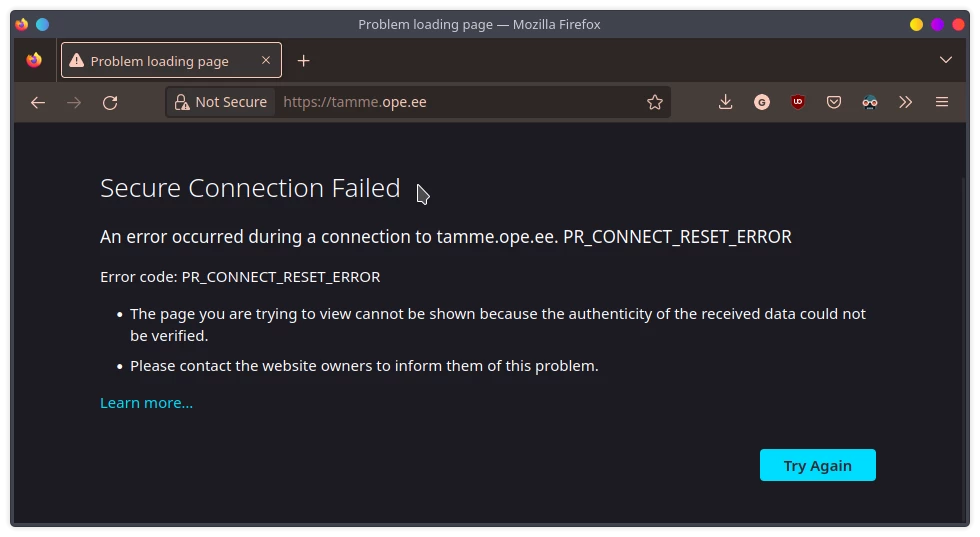
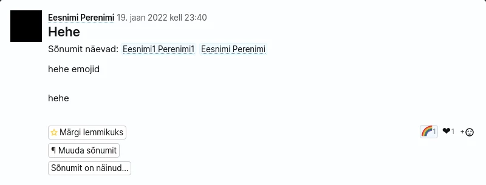

# StuScraper

CLI tool to scrape Stuudium's ope.ee sites for user information.

Requres an account on site.

## Shoutout to Stuudium



## Stu-cli

login works with password and with Smart-ID.

Some outdated examples can be found at [examples](./assets/examples.md)

## Installation

### Pip package

OS - follows the UNIX filesystem, such as Linux and MacOS

requirements: `python3` and `pip`

```
pip install --upgrade stuscraper
```

To upgrade the package run the same command

### Source

OS - all platform

Clone the repository and enter the directory

```
git clone https://github.com/goldenbeasty/stuscraper && cd stuscraper
```

and run `stu-cli.py`

```
python3 ./stu-cli.py
```

## First time login

If you want to change what school's Stuudium you log into delete the config.ini file found at `~/.config/stuscraper/config.ini` or in case of source installation in the same folder as the program `./config.ini`
The ability to do that in program will be added soon

## Fun facts about Stuudium

### Stuudium's security model

Stuudium has a permission based security model where school's IT-admins and other administrative staff have permission to view the whole platform as someone else (meaning you don't have any privacy on the platform)

### Suhtlus

The messaging feature is just build separately from everything else (still integrates though). Just has different dependecies and stuff.

### Teatchers can view your birthdays and a lot more stuff

### April fools

On April 1st 2022 you were able to submit "kind words to others" on stuudium and for the 1st and 2nd of April these messages could be seen on the user home page.

### Backend

The website is run on aws, it can most be seen in TERA, where files are hosted in s3 buckets.

### 1984

In the messaging section (as of 01.01.2023) you can react with emojis, currenttly you can react with up to eight different emojis out of which with only 6 at the same time.
It didn't use to be that way some time afte 15.01.2021 was the ability to react with any emoji removed. While you could react with any emoji some emojis were shadowbanned such as the eggplant emoji and the middle finger emoji.
Any emoji reaction isn't removed from the backend and posts older than 15.01.2021 can still be seen with any emoji. About that, the API endpoint for emojis wasn't removed until at least 19.01.2022, until that point I was still able to react to a message with a custom emoji by manually editing the POST request. Subsequent tries have failed.



### other (technical)

#### list of all schools
https://assets.stuudium.net/_/config/clients
(includes test schools)
has chainged to

https://stuudium.com/_/pweb/get-public-clients 
(does not include test schools)

# Licence

Copyright 2023 Goldenbeasty

StuScraper is free software: you can redistribute it and/or modify it under the terms of the GNU General Public License as published by the Free Software Foundation, either version 3 of the License, or (at your option) any later version.

StuScraper is distributed in the hope that it will be useful, but WITHOUT ANY WARRANTY; without even the implied warranty of MERCHANTABILITY or FITNESS FOR A PARTICULAR PURPOSE. See the GNU General Public License for more details.

You should have received a copy of the GNU General Public License along with StuScraper. If not, see <https://www.gnu.org/licenses/>. 

Copyright by Goldenbeasty
